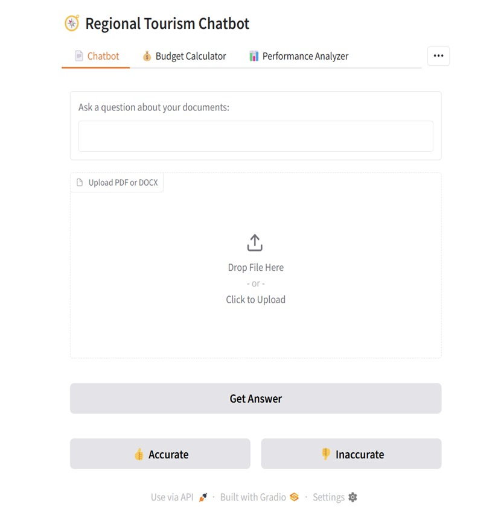
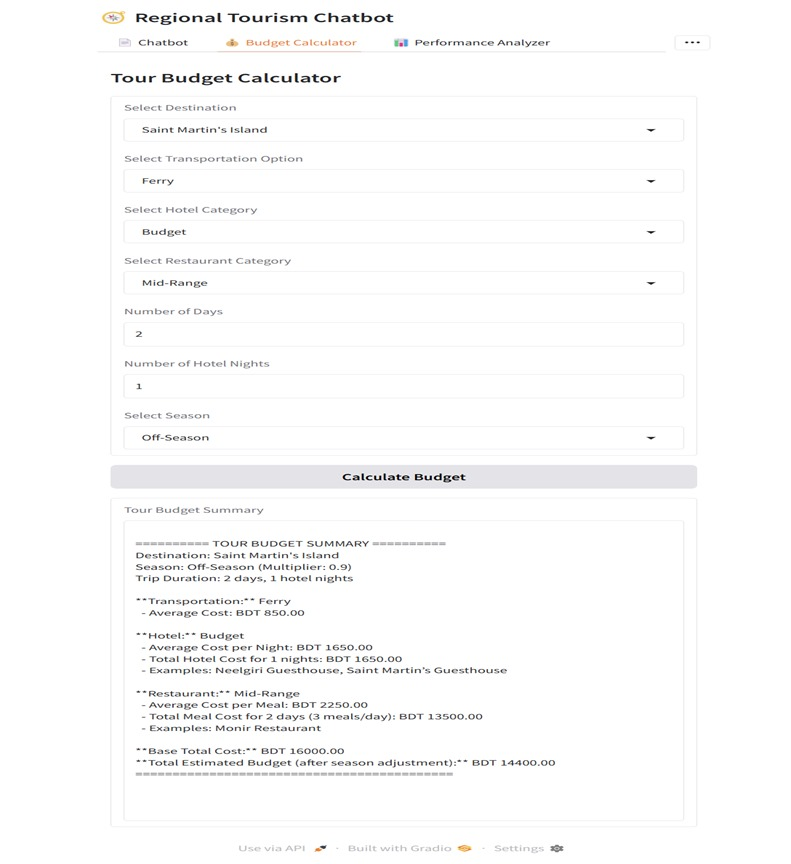
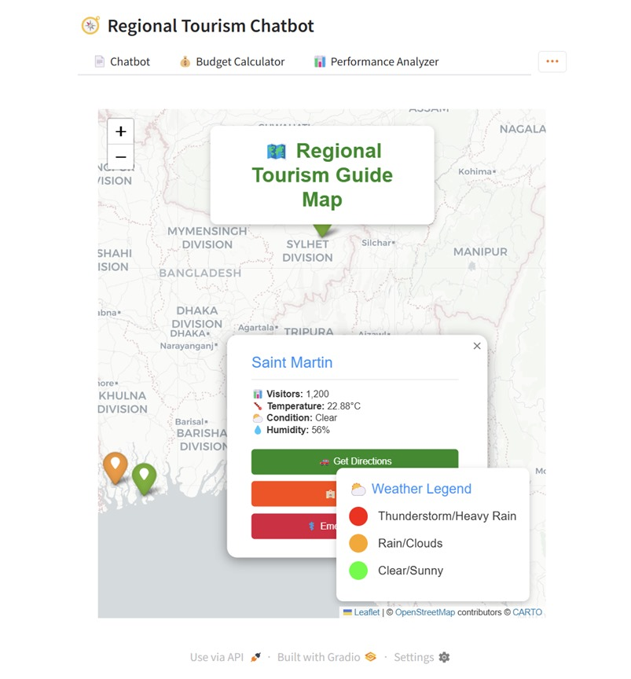
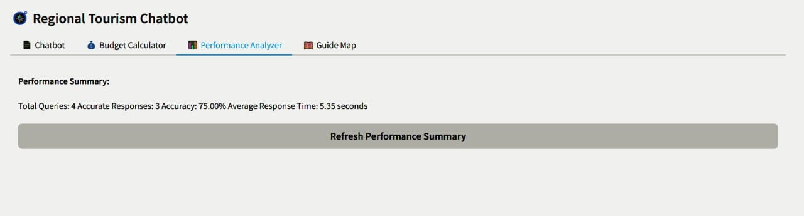

# Travelmate BD – Regional Tourism Chatbot

[](https://colab.research.google.com/github/azmain-arnob/Regional-Travelmate-Chatbot/blob/main/colab_setup.py)

Travelmate BD is an AI-driven regional tourism assistant built to help users plan trips across Bangladesh. The application integrates a multilingual conversational interface, an automated tour budget estimator, a document-based Q&A engine, and a real-time system performance monitor into a unified Gradio dashboard.

This project was developed for **CSE 299: Junior Design Project (Spring 2025)** at North South University under the supervision of **Dr. Shafin Rahman**.

---

## Application Preview


*Figure 1: Multilingual Tourism Assistant Interface.*


*Figure 2: Automated Tour Budget Calculator.*


*Figure 3: Interactive Regional Tourism Map.*


*Figure 4: Real-time System Performance Monitor.*

---

## Technical Overview

* **Multilingual Chatbot:** Powered by `deepseek-ai/deepseek-llm-7b-base` to answer travel and regional queries in Bangla and English.
* **Document Q&A System:** Leverages ChromaDB and sentence transformers to extract context-aware insights from uploaded PDF and DOCX files.
* **Tour Budget Calculator:** Algorithmic expense estimation based on transport mode, accommodation tier, and dining preferences.
* **System Monitor:** Uses `psutil` to track runtime memory consumption and response latency.

---

## Repository Structure

```text
Regional-Travelmate-Chatbot/
├── assets/                  # Application UI screenshots
│   ├── chatbot_interface.jpg
│   ├── budget_calculator.jpg
│   ├── interactive_map.jpg
│   └── performance_report.jpg
├── app.py                   # Main Gradio application entry point
├── colab_setup.py           # Dependency installation script for Google Colab
├── core_utils.py            # Model loading & document processing modules
├── performance_analyzer.py # Memory and latency profiling utilities
├── tour_budget.py           # Expense calculation logic
├── requirements.txt         # Project dependencies
└── .env.example             # Environment variable template

---

## Getting Started

### Prerequisites

* Google Colab (with T4 GPU runtime enabled)
* Hugging Face Access Token

### Installation & Execution

1. Clone the repository:
   ```bash
   git clone https://github.com/azmain-arnob/Regional-Travelmate-Chatbot.git
   cd Regional-Travelmate-Chatbot
   ```

2. Configure environment variables:
   Create a `.env` file in the root directory based on `.env.example`:
   ```bash
   HUGGINGFACE_TOKEN=your_actual_token_here
   ```

3. Install dependencies and run the application:
   ```bash
   python colab_setup.py
   python app.py
   ```

---

## Academic Context

* **Course:** CSE 299 – Junior Design Project (Spring 2025, Section 19)
* **Institution:** North South University
* **Supervisor:** Dr. Shafin Rahman
* **Team Members:** Azmain Iqtidar Arnob, Md Nayeem Porag Molla, Atikul Islam Nahid, Md Ashraful Islam
